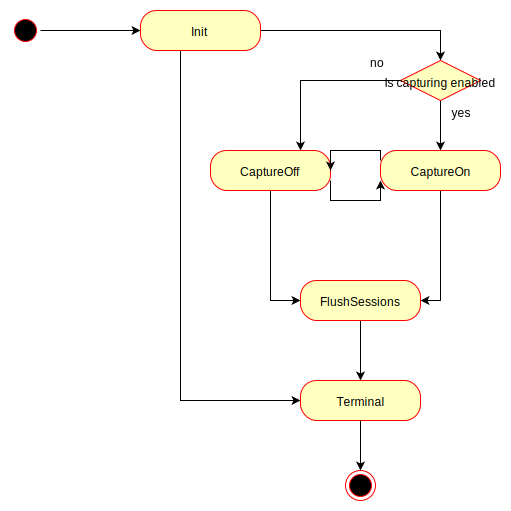

#OpenKit - Internals

## Data Sending (Beacon sending)

All data sending, including synchronization with the backend (Dynatrace SaaS/Dynatrace Managed/AppMon)
happens asynchronously by starting an own thread when OpenKit is initialized.  

Beacon sending in OpenKit is implemented using a state pattern. The following 
diagram illustrates the states.

## Initialize

The Init state (class `BeaconSendingInitState`) sends the initial status request to the server.
The request is retried several times (by default 5 retries, in total 6 requests) with increasing
delays between consecutive retries.  
If the server returned a status response a state transition to TimeSync is performed, otherwise
OpenKit stays in the Initialize state, but sleeps some time until the next status request is sent. 
 
If OpenKit.shutdown() is called while OpenKit is in the Init state, 
a transition to the Terminal state is performed.

## TimeSync

In the TimeSync state (class `BeaconSendingTimeSyncState`) 5 time sync timestamp pairs, in total
10 timestamps, are fetched. The timestamps are used to calculate the time offset to the backend. 
To retrieve a pair of timestamps one time sync request is sent with a maximum amount of retries 
(by default 5 retries, therefore in total 6 requests for one timestamp pair).  
If a server does not support time sync (e.g. AppMon) all further retries are skipped and no 
further time sync will happen.  In this case a transition to either CaptureOn state or CaptureOff 
state is performed, based on the initial configuration obtained in Init state.
If the number of time sync retries is exceeded the time sync is unsuccessful and therefore a
transition to CaptureOff is performed.
 
The algorithm used to compute the cluster time offset is similar to the algorithm used by 
[NTP](https://en.wikipedia.org/wiki/Network_Time_Protocol#Clock_synchronization_algorithm).

If `OpenKit.shutdown()` is called while OpenKit is in the TimeSync state, a transition to either 
Terminal state or FlushSession state is performed. The transition to the Terminal state 
is only performed if the initial time sync was not completed before the call to `shutdown()`.

## CaptureOff

In the CaptureOff state (class `BeaconSendingCaptureOffState`) OpenKit checks when the last
status request was sent to the server and sleeps some time before performing the next status
request.  
If time sync is supported by the server and the initial time sync failed a state transition
to time sync is performed.  
If the initial time sync was successfully performed, a transition to CaptureOn state is performed
if capturing was enabled by the server's status response. If capturing is disabled
then no transition is performed and the state machine stays in CaptureOff state.  

If OpenKit is shut down during CaptureOff state a transition to FlushSessions is performed.

## CaptureOn

In the CaptureOn state (class `BeaconSendingCaptureOnState`) OpenKit checks in regular intervals
(the default value is 1 second) if it should send open sessions. The interval for sending
open sessions is configured in the status response.  
Furthermore all previously finished sessions are also sent to the server.  

Data sending is retried three times to avoid data loss with increasing delays between consecutive
retries.

If OpenKit is shut down during CaptureOn state a transition to FlushSessions is performed.

## FlushSessions

The FlushSessions state (class `BeaconSendingFlushSessionsState`) is used to send all
data which has not been transferred so far to the server.

## Terminal

The Terminal state (class `BeaconSendingTerminalState`) is the last state in OpenKit's internal 
state machine. After this state is reached the background thread responsible for sending data 
is terminated gracefully.
